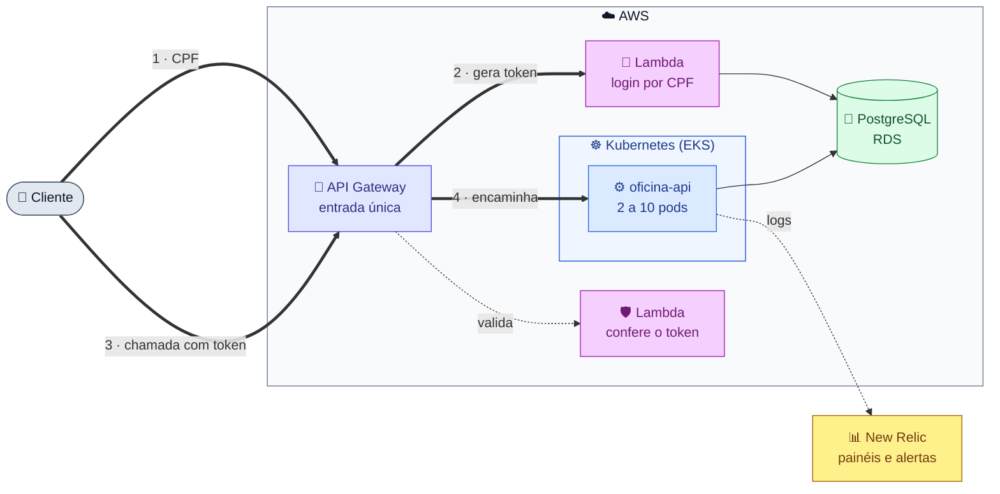
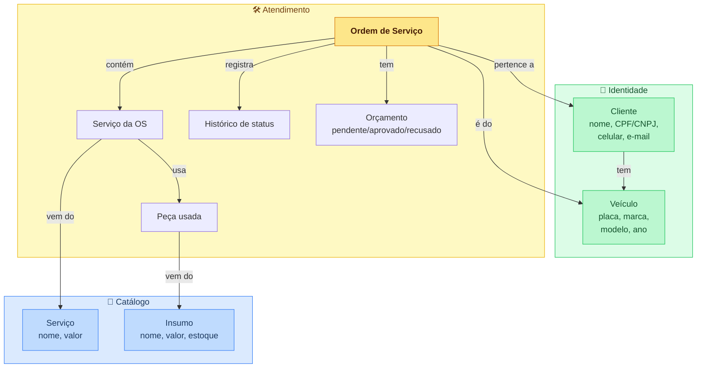
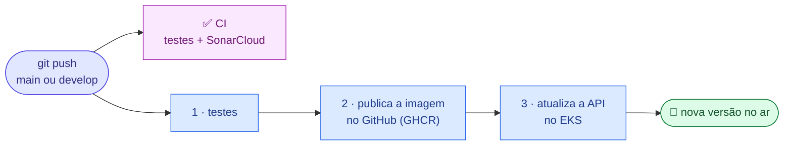

# Oficina Mecânica API

API REST para gestão de uma oficina mecânica: clientes, veículos, serviços,
peças e ordens de serviço (OS).

**Tech Challenge 13SOAT — Fase 3.** A aplicação roda na AWS: autenticação por
CPF em uma função serverless, API em Kubernetes (EKS), banco gerenciado (RDS) e
monitoramento no New Relic.

## Sumário

- [Links](#links)
- [Arquitetura da Fase 3](#arquitetura-da-fase-3)
- [Como testar](#como-testar)
- [Autenticação por CPF](#autenticação-por-cpf)
- [Documentação técnica](#documentação-técnica)
- [Stack](#stack)
- [Código: arquitetura hexagonal](#código-arquitetura-hexagonal)
- [Rodar localmente](#rodar-localmente)
- [CI/CD](#cicd)
- [Rotas da API](#rotas-da-api)

## Links

| O quê | Link |
|---|---|
| 🚪 API em produção (API Gateway) | https://q7m1gn8vqi.execute-api.us-east-1.amazonaws.com |
| 📘 Swagger | [abrir no Swagger Editor](https://editor.swagger.io/?url=https://raw.githubusercontent.com/Lorenalgm/oficina_mecanica/main/openapi.yaml) · arquivo [`openapi.yaml`](openapi.yaml) |
| 🔐 Repositório da autenticação | [oficina-auth-lambda](https://github.com/Lorenalgm/oficina-auth-lambda) |
| ☸️ Repositório do Kubernetes | [oficina-infra-k8s](https://github.com/Lorenalgm/oficina-infra-k8s) |
| 🐘 Repositório do banco | [oficina-infra-db](https://github.com/Lorenalgm/oficina-infra-db) |

> O ambiente roda no **AWS Academy Learner Lab**, que desliga os recursos ao fim
> de cada sessão. Fora das sessões de demonstração, a URL pode estar fora do ar.

## Arquitetura da Fase 3

O sistema foi dividido em **4 repositórios**, cada um com sua pipeline:

| Repositório | Responsabilidade |
|---|---|
| **oficina_mecanica** (este) | Código da API, imagem Docker e manifestos Kubernetes |
| [oficina-auth-lambda](https://github.com/Lorenalgm/oficina-auth-lambda) | API Gateway e Lambdas de login por CPF |
| [oficina-infra-k8s](https://github.com/Lorenalgm/oficina-infra-k8s) | Cluster EKS, Ingress e agente do New Relic |
| [oficina-infra-db](https://github.com/Lorenalgm/oficina-infra-db) | Rede (VPC), banco RDS e Secrets Manager |

Leia o caminho da requisição pelos números **(1 → 4)**:



**Legenda:** ⬜ cliente · 🟪 autenticação · 🟦 aplicação · 🟩 banco · 🟨 monitoramento

Diagrama completo, com todos os componentes: [componentes.md](docs/arquitetura/componentes.md).

## Como testar

Pelo **Swagger** ([link](https://editor.swagger.io/?url=https://raw.githubusercontent.com/Lorenalgm/oficina_mecanica/main/openapi.yaml)):

1. Em **Servers**, escolha *Produção (AWS API Gateway)*.
2. Chame `POST /auth` com o CPF de um cliente cadastrado.
3. Copie o `token` da resposta, clique em **Authorize** e cole.
4. Chame as rotas protegidas, por exemplo `GET /api/os`.

Ou pelo terminal:

```bash
API=https://q7m1gn8vqi.execute-api.us-east-1.amazonaws.com

TOKEN=$(curl -s -X POST "$API/auth" \
  -H 'Content-Type: application/json' \
  -d '{"cpf":"<CPF do cliente>"}' | jq -r .token)

curl "$API/api/os" -H "Authorization: Bearer $TOKEN"
```

## Autenticação por CPF

O cliente se identifica **só pelo CPF**, sem senha:

1. `POST /auth` chega à **Lambda `authenticate`**, que confere os dígitos do CPF,
   busca o cliente no banco e devolve um **token JWT** válido por 1 hora.
2. Nas rotas `/api/*`, a **Lambda `authorizer`** confere o token antes de a
   chamada chegar ao cluster.
3. A API confere o token de novo (middleware `ValidarJwt`), porque o cluster
   também pode ser acessado sem passar pelo Gateway.

| Resposta de `POST /auth` | Quando |
|---|---|
| **200** + token | CPF válido e cliente cadastrado |
| **400** | CPF com dígitos inválidos |
| **404** | CPF válido, mas cliente não cadastrado |

Rotas **sem token**: `POST /auth`, `GET /api/consulta-publica` e a aprovação
ou recusa de orçamento (protegidas por um token de uso único enviado ao cliente).

Diagramas passo a passo: [sequencia-auth.md](docs/arquitetura/sequencia-auth.md).

## Documentação técnica

| Documento | Assunto |
|---|---|
| [Componentes](docs/arquitetura/componentes.md) | Visão geral da AWS e quem faz o quê |
| [Autenticação](docs/arquitetura/sequencia-auth.md) | Login por CPF e uso do token |
| [Abertura de OS](docs/arquitetura/sequencia-abertura-os.md) | Fluxo da requisição e ciclo de vida da OS |
| [Modelo de dados](docs/arquitetura/modelo-de-dados.md) | Diagrama ER e relacionamentos |
| [RFC-001](docs/rfcs/RFC-001-escolha-da-nuvem.md) | Escolha da nuvem |
| [RFC-002](docs/rfcs/RFC-002-banco-de-dados.md) | Escolha do banco de dados |
| [RFC-003](docs/rfcs/RFC-003-estrategia-de-autenticacao.md) | Estratégia de autenticação |
| [ADR-001](docs/adrs/ADR-001-api-gateway-lambda-authorizer.md) | API Gateway com Lambda Authorizer |
| [ADR-002](docs/adrs/ADR-002-uso-de-hpa.md) | Escalabilidade automática (HPA) |
| [ADR-003](docs/adrs/ADR-003-observabilidade-via-logs-estruturados.md) | Monitoramento por logs estruturados |
| [ADR-004](docs/adrs/ADR-004-labrole-no-aws-academy.md) | Permissões no AWS Academy |
| [Consultas NRQL](docs/observabilidade/nrql.md) | Consultas dos painéis do New Relic |

## Stack

| Camada | Tecnologia | Por quê |
|---|---|---|
| Aplicação | PHP 8.4, Laravel 11 | Framework maduro para APIs REST |
| Servidor | Docker + FrankenPHP | Uma imagem só, com servidor HTTP embutido |
| Banco | PostgreSQL 16 (Amazon RDS) | Dados relacionais e transações ([RFC-002](docs/rfcs/RFC-002-banco-de-dados.md)) |
| Autenticação | JWT emitido por AWS Lambda | Login por CPF, validado sem consultar o banco ([RFC-003](docs/rfcs/RFC-003-estrategia-de-autenticacao.md)) |
| Orquestração | Kubernetes (EKS na nuvem, kind local) | Escala automática por CPU e memória |
| Monitoramento | New Relic | Logs, painéis e alertas |
| Testes | PHPUnit + SQLite em memória | Rápidos e sem banco externo |
| CI/CD | GitHub Actions + SonarCloud | Testes, qualidade e deploy a cada push |

## Código: arquitetura hexagonal

As regras de negócio não dependem do Laravel. A camada de infraestrutura
implementa as interfaces definidas no domínio.

```
src/
├── Domain/          # Regras de negócio e interfaces (sem framework)
│   ├── Shared/      # CPF/CNPJ e placa
│   ├── Catalogo/    # Serviço e insumo (peça)
│   ├── Identidade/  # Cliente e veículo
│   └── Atendimento/ # OS, orçamento e histórico de status
├── Application/     # Casos de uso (CriarOS, AprovarOrcamento, ...)
└── Infrastructure/  # Banco (Eloquent) e eventos
```



## Rodar localmente

**Com Docker Compose** (API + PostgreSQL):

```bash
cp .env.example .env
docker compose up -d
docker compose exec app php artisan key:generate
docker compose exec app php artisan migrate --seed
# API em http://localhost:8000
```

Para rotas protegidas localmente, defina `JWT_SECRET` no `.env` com a mesma
chave usada para gerar o token.

**Testes:**

```bash
php artisan test                        # suíte completa
php artisan test --coverage --min=80    # com cobertura (requer PCOV ou Xdebug)
```

**Em Kubernetes local (kind):** o cluster é criado pelo repositório
[oficina-infra-k8s](https://github.com/Lorenalgm/oficina-infra-k8s) com
`make local-up`. Depois:

```bash
kubectl apply -k k8s/
kubectl -n oficina rollout status deployment/oficina-api
kubectl -n oficina port-forward svc/oficina-api 8081:80
```

**E-mail de mudança de status (Resend):** configure `RESEND_API_KEY` no `.env`.
Sem e-mail cadastrado ou com falha no envio, a mudança de status acontece
normalmente e o erro vai para o log.

## CI/CD



- `main` = produção, `develop` = homologação.
- A branch `main` é protegida: só recebe código por pull request.
- As senhas do banco vêm do **Secrets Manager** e são entregues ao cluster no
  deploy, sem ficar no repositório.

## Rotas da API

Contrato completo no [Swagger](https://editor.swagger.io/?url=https://raw.githubusercontent.com/Lorenalgm/oficina_mecanica/main/openapi.yaml).
🔒 = exige token.

### Autenticação

| Método | Rota | | Descrição |
|---|---|:-:|---|
| POST | `/auth` | | Login por CPF, devolve o token |

### Cadastros

| Método | Rota | | Descrição |
|---|---|:-:|---|
| GET · POST | `/api/clientes` | 🔒 | Listar · criar cliente (CPF/CNPJ validado) |
| GET · PUT · DELETE | `/api/clientes/{id}` | 🔒 | Buscar · atualizar · remover |
| GET · POST | `/api/veiculos` | 🔒 | Listar · criar veículo (placa validada) |
| GET · PUT · DELETE | `/api/veiculos/{id}` | 🔒 | Buscar · atualizar · remover |
| GET · POST | `/api/servicos` | 🔒 | Listar · criar serviço |
| GET · PUT · DELETE | `/api/servicos/{id}` | 🔒 | Buscar · atualizar · remover |
| GET · POST | `/api/insumos` | 🔒 | Listar · criar peça |
| GET · PUT · DELETE | `/api/insumos/{id}` | 🔒 | Buscar · atualizar · remover |

### Ordens de serviço

| Método | Rota | | Descrição |
|---|---|:-:|---|
| POST | `/api/os` | 🔒 | Abrir OS (serviços e peças são opcionais) |
| GET | `/api/os` | 🔒 | Listar OS por prioridade (ver abaixo) |
| GET | `/api/os/{id}` | 🔒 | Detalhar OS |
| PATCH | `/api/os/{id}/status` | 🔒 | Mudar status (envia e-mail ao cliente) |
| POST | `/api/os/{id}/servicos` | 🔒 | Adicionar serviço |
| POST | `/api/os/{id}/servicos/{osServicoId}/insumos` | 🔒 | Adicionar peça ao serviço |
| POST | `/api/os/{id}/orcamento` | 🔒 | Gerar orçamento (OS vai para *Aguardando aprovação*) |
| GET | `/api/os/tempo-medio` | 🔒 | Tempo médio de execução, em minutos |
| POST | `/api/os/{id}/orcamento/aprovar` | token do orçamento | Aprovar: baixa o estoque e inicia a execução |
| POST | `/api/os/{id}/orcamento/recusar` | token do orçamento | Recusar o orçamento |
| GET | `/api/consulta-publica` | | Status da OS pelo documento + placa |

**Listagem de OS:** ordem *Em execução* → *Aguardando aprovação* →
*Em diagnóstico* → *Recebida*; dentro do mesmo status, as mais antigas primeiro.
OS *Finalizadas* e *Entregues* não aparecem. Filtros: `cliente_id`,
`veiculo_id`, `status_id`.

**Exemplo de abertura:**

```json
{
  "cliente_id": 1,
  "veiculo_id": 1,
  "descricao_problema": "Barulho na suspensão",
  "servicos": [
    { "servico_id": 3, "insumos": [ { "insumo_id": 5, "quantidade": 2 } ] },
    { "servico_id": 4 }
  ]
}
```

**Token do orçamento:** gerado junto com o orçamento, enviado na query string
ou no corpo e válido para **um uso só**. Sem token válido, a resposta é **401**.
