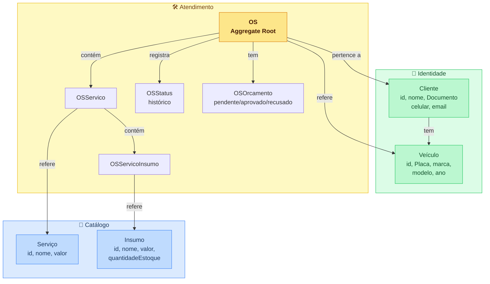
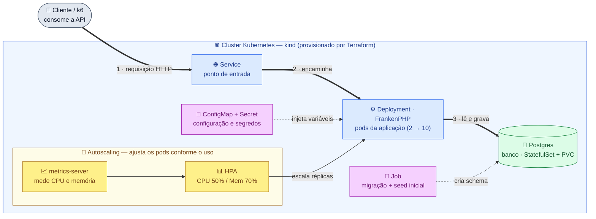
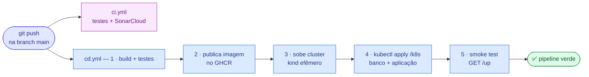

# Oficina Mecânica API

Back-end de gestão de uma oficina mecânica: uma **API REST** em **Laravel 11** com **arquitetura hexagonal (DDD)**, containerizada com **Docker**, orquestrada em **Kubernetes** com escalabilidade automática, provisionada por **Terraform** e entregue por uma **pipeline CI/CD**.

## Sumário

- [Solução e objetivos da Fase 2](#solução-e-objetivos-da-fase-2)
- [Testar a API em produção](#testar-a-api-em-produção)
- [Stack e justificativas](#stack-e-justificativas)
- [Arquitetura da aplicação](#arquitetura-da-aplicação)
- [Domínio (bounded contexts)](#domínio-bounded-contexts)
- [Executar a aplicação localmente](#executar-a-aplicação-localmente)
- [Infraestrutura: Kubernetes, Terraform e CI/CD](#infraestrutura-kubernetes-terraform-e-cicd)
- [Referência da API](#referência-da-api)

## Solução e objetivos da Fase 2

Na Fase 1 a oficina ganhou um sistema para gerir ordens de serviço, veículos, clientes e peças. Com o aumento da demanda e a expansão para novas unidades, a Fase 2 evolui a aplicação para **qualidade, resiliência e escalabilidade**, incorporando práticas modernas de infraestrutura e automação.

**O que foi entregue nesta fase:**

- **Refatoração para arquitetura hexagonal (DDD):** os casos de uso dependem apenas de interfaces de domínio (portas), sem acoplamento a `App\Models` ou à facade `DB`. Camadas separadas em `src/Domain`, `src/Application` e `src/Infrastructure`, com testes automatizados cobrindo os fluxos críticos.
- **Evolução das APIs de OS:** abertura de OS (cliente, veículo, serviços e peças) retornando o identificador único; consulta de status; **listagem ordenada por prioridade de status** (Em Execução → Aguardando Aprovação → Diagnóstico → Recebida), mais antigas primeiro, excluindo logicamente as Finalizadas/Entregues; **aprovação/recusa de orçamento** por webhook público protegido por token de uso único; e **notificação de mudança de status por e-mail** (Resend).
- **Containerização:** imagem de produção com Docker/FrankenPHP e `docker-compose` para desenvolvimento local.
- **Orquestração em Kubernetes:** manifestos em [`/k8s`](k8s) (Deployment, Service, ConfigMap, Secret e HPA por CPU **e** memória).
- **Infraestrutura como Código:** scripts Terraform em [`/infra`](infra) provisionando o cluster (kind), o metrics-server, o namespace, o Secret e o banco de dados.
- **CI/CD (GitHub Actions):** build, testes automatizados, build e publicação da imagem, e deploy dos manifestos no cluster.

O detalhamento de cada ponto está nas seções a seguir.

## Testar a API em produção

A aplicação está publicada (deploy contínuo no Railway):

**Base URL:** `https://oficinamecanica-production-46fd.up.railway.app`

Importe o [`openapi.yaml`](openapi.yaml) no Insomnia, Postman ou Swagger e aponte o servidor para a URL acima. Fluxo mínimo:

1. `POST /api/login` com `{ "email": "...", "password": "..." }` → retorna o token
2. Envie o token no header `Authorization: Bearer {token}` nas demais rotas

## Stack e justificativas

**Aplicação**
- **PHP 8.4 / Laravel 11** — framework maduro para APIs REST.
- **PostgreSQL 16** — integridade referencial robusta e boa performance em agregações (ex.: tempo médio de execução).
- **Laravel Sanctum** — autenticação por token, adequada a APIs.
- **OpenAPI 3.0** — contrato da API em `openapi.yaml`, importável em qualquer cliente REST.
- **PHPUnit + SQLite em memória** — testes isolados, sem banco externo.

**Infraestrutura**
- **Docker + FrankenPHP** — imagem única de produção, com servidor HTTP embutido.
- **Kubernetes (kind)** — orquestração e escalabilidade automática (HPA); `kind` provê um cluster local, reproduzível e gratuito.
- **Terraform** — infraestrutura como código, declarativa e reproduzível.
- **GitHub Actions** — CI (testes + análise de qualidade) e CD (build, imagem e deploy).
- **k6** — teste de carga como código, para demonstrar o autoscaling.

## Arquitetura da aplicação

Monolito organizado em camadas (DDD / arquitetura hexagonal): o domínio e os casos de uso não dependem do framework; a infraestrutura implementa as interfaces do domínio.

```
src/
├── Domain/                          # Regras de negócio e contratos (sem framework)
│   ├── Shared/ValueObjects/         # Documento (CPF/CNPJ), Placa
│   ├── Catalogo/                    # Serviço, Insumo, repositórios
│   ├── Identidade/                  # Cliente, Veículo, repositórios
│   └── Atendimento/                 # OS (Aggregate Root), OSOrcamento, OSStatus
├── Application/                     # Casos de uso (orquestração)
│   └── {Servico,Insumo,Cliente,Veiculo,OS}/UseCases/
└── Infrastructure/Persistence/Eloquent/
    ├── *Mapper.php                  # Model Eloquent ↔ entidade de domínio
    └── Eloquent*Repository.php      # Implementação dos repositórios
```

## Domínio (bounded contexts)



> `User` existe apenas como infraestrutura de autenticação (Sanctum) — não pertence ao domínio da oficina.

## Executar a aplicação localmente

**Com Docker Compose** (aplicação + PostgreSQL):

```bash
cp .env.example .env
docker compose up -d
docker compose exec app php artisan key:generate
docker compose exec app php artisan migrate --seed
# API em http://localhost:8000
```

**Sem Docker:**

```bash
cp .env.example .env      # configure DB_CONNECTION=pgsql, DB_HOST=127.0.0.1
composer install
php artisan key:generate
php artisan migrate --seed
php artisan serve
```

**Testes:**

```bash
php artisan test                        # suíte completa (SQLite em memória)
php artisan test --coverage --min=80    # com cobertura (requer PCOV ou Xdebug)
```

**Notificações por e-mail (Resend).** A alteração de status de uma OS dispara um e-mail ao cliente via [`resend/resend-laravel`](https://github.com/resend/resend-laravel). Se o cliente não tiver e-mail cadastrado, a operação conclui normalmente (apenas registra em log). Configure no `.env`:

```dotenv
MAIL_MAILER=resend
MAIL_FROM_ADDRESS="onboarding@resend.dev"   # remetente de teste do Resend (sem verificar domínio)
MAIL_FROM_NAME="Oficina Mecânica"
RESEND_API_KEY=                             # sua chave da Resend
```

> `onboarding@resend.dev` entrega apenas para o e-mail dono da conta Resend; em produção, use um remetente de domínio verificado. Uma falha de envio nunca interrompe a troca de status (é registrada em log). Nos testes usa-se `Mail::fake()`, portanto nenhuma chave real é necessária.

## Infraestrutura: Kubernetes, Terraform e CI/CD

A mesma aplicação é empacotada em imagem de produção, orquestrada em Kubernetes (com escalabilidade automática), provisionada por Terraform e entregue por uma pipeline CI/CD. Essa camada é **independente** do deploy no Railway.

### Arquitetura proposta

Componentes da aplicação e infraestrutura provisionada:

Leia o **fluxo principal pelos números (1 → 2 → 3)**: a requisição entra pela borda (Service), passa pela aplicação (pods) e chega ao banco. À parte, o bloco **Autoscaling** observa o consumo e ajusta o número de pods — por isso não entra na numeração: é um mecanismo contínuo, não um passo da requisição.



**Legenda:** 🟦 aplicação · 🟩 banco de dados · 🟪 configuração e segredos · 🟨 autoscaling · ⬜ cliente (externo)

### Fluxo de deploy (CI/CD)

A cada `push` na `main`:



> **Deploy no CI é efêmero:** o `cd.yml` sobe um cluster kind **dentro do runner** apenas para validar o deploy ponta a ponta, e o destrói ao final — não expõe uma URL pública. A **imagem**, porém, é publicada de verdade e fica visível na aba **Packages** do repositório (`ghcr.io/lorenalgm/oficina-api`). Para um ambiente persistente, use o kind local (abaixo) ou o Railway.

### Pré-requisitos

Docker (em execução) e as CLIs `kind`, `kubectl`, `terraform`, `helm` e `k6`.
No macOS: `brew install kind kubectl terraform helm k6`.

### Passo a passo (do zero)

```bash
# 1. Variáveis sensíveis (não versionadas)
cd infra
cp terraform.tfvars.example terraform.tfvars
php ../artisan key:generate --show     # cole o "base64:..." em app_key; defina também db_password
#   (sem PHP à mão? use: echo "base64:$(openssl rand -base64 32)")

# 2. Provisionar a plataforma (cluster + metrics-server + namespace + secret + Postgres)
terraform init
terraform apply                        # confirme com "yes"
cd ..

# 3. Selecionar o cluster (kubeconfig gerado pelo Terraform)
export KUBECONFIG="$(pwd)/infra/oficina-config"
kubectl get nodes

# 4. Construir a imagem de produção e carregá-la no cluster
docker build -f docker/app/Dockerfile -t ghcr.io/lorenalgm/oficina-api:latest .
kind load docker-image ghcr.io/lorenalgm/oficina-api:latest --name oficina

# 5. Implantar a aplicação
kubectl apply -k k8s/
kubectl -n oficina rollout status deployment/oficina-api

# 6. Acessar a API
kubectl -n oficina port-forward svc/oficina-api 8080:80
# em outro terminal:  curl http://localhost:8080/up
```

> Exporte `KUBECONFIG="$(pwd)/infra/oficina-config"` (a partir da raiz do projeto) em cada novo terminal.

### Demonstração de autoscaling (HPA + k6)

Com a aplicação implantada, use **três terminais** (todos com o `KUBECONFIG` exportado):

```bash
# Terminal 1 — expõe a API
kubectl -n oficina port-forward svc/oficina-api 8080:80

# Terminal 2 — acompanha o escalonamento
kubectl -n oficina get hpa,pods -w
#   (opcional, com visual: brew install k9s && k9s -n oficina)

# Terminal 3 — gera carga, com dashboard ao vivo
K6_WEB_DASHBOARD=true BASE_URL=http://localhost:8080 k6 run load/load-test.js
#   dashboard em tempo real: http://localhost:5665
```

A carga simula o uso real (autentica, cria cliente e veículo e gera múltiplas ordens de serviço). Conforme a CPU ultrapassa o alvo de 50%, o HPA aumenta as réplicas de **2 até 10**; ao cessar a carga, elas retornam a 2. Mais detalhes em [`load/README.md`](load/README.md).

### Limpeza

```bash
cd infra && terraform destroy      # remove o cluster kind (o Railway não é afetado)
```

## Referência da API

Contrato completo em [`openapi.yaml`](openapi.yaml).

### Autenticação
| Método | Rota | Auth | Descrição |
|--------|------|:----:|-----------|
| POST | `/api/login` | — | Autenticar e obter token Sanctum |
| POST | `/api/logout` | ✓ | Revogar token |

### Catálogo
| Método | Rota | Auth | Descrição |
|--------|------|:----:|-----------|
| GET / POST | `/api/servicos` | ✓ | Listar / criar serviço |
| GET / PUT / DELETE | `/api/servicos/{id}` | ✓ | Buscar / atualizar / remover serviço |
| GET / POST | `/api/insumos` | ✓ | Listar / criar insumo |
| GET / PUT / DELETE | `/api/insumos/{id}` | ✓ | Buscar / atualizar / remover insumo |

### Identidade
| Método | Rota | Auth | Descrição |
|--------|------|:----:|-----------|
| GET / POST | `/api/clientes` | ✓ | Listar / criar cliente (CPF/CNPJ validado) |
| GET / PUT / DELETE | `/api/clientes/{id}` | ✓ | Buscar / atualizar / remover cliente |
| GET / POST | `/api/veiculos` | ✓ | Listar / criar veículo (placa validada) |
| GET / PUT / DELETE | `/api/veiculos/{id}` | ✓ | Buscar / atualizar / remover veículo |

### Atendimento (Ordens de Serviço)
| Método | Rota | Auth | Descrição |
|--------|------|:----:|-----------|
| GET | `/api/os` | ✓ | Listar OS (ordenada por prioridade — ver abaixo) |
| POST | `/api/os` | ✓ | Criar OS |
| GET | `/api/os/{id}` | ✓ | Detalhar OS |
| PATCH | `/api/os/{id}/status` | ✓ | Alterar status (dispara e-mail ao cliente) |
| POST | `/api/os/{id}/servicos` | ✓ | Adicionar serviço à OS |
| POST | `/api/os/{id}/servicos/{osServicoId}/insumos` | ✓ | Adicionar insumo ao serviço |
| POST | `/api/os/{id}/orcamento` | ✓ | Gerar orçamento → *Aguardando aprovação*; retorna o `approval_token` |
| GET | `/api/os/tempo-medio` | ✓ | Tempo médio de execução (minutos) |

**Abertura (`POST /api/os`):** exige `cliente_id`, `veiculo_id` e `descricao_problema`. Serviços e peças (insumos) são **opcionais** na abertura e podem vir aninhados — cada peça é vinculada a um serviço:

```json
{
  "cliente_id": 1,
  "veiculo_id": 1,
  "descricao_problema": "Barulho na suspensão",
  "servicos": [
    { "servico_id": 3, "insumos": [ { "insumo_id": 5, "quantidade": 2 } ] },
    { "servico_id": 4 }
  ]
}
```

Também é possível abrir a OS só com os dados obrigatórios e adicionar serviços/peças depois pelos endpoints `POST /api/os/{id}/servicos` e `.../insumos`. Retorna **201** com o identificador único da OS.

**Listagem (`GET /api/os`):** ordenada por prioridade de status (*Em execução* > *Aguardando aprovação* > *Em diagnóstico* > *Recebida*); OS *Finalizada* e *Entregue* são omitidas da listagem. No mesmo status, as mais antigas vêm primeiro. Filtros `cliente_id`, `veiculo_id` e `status_id` disponíveis.

### Aprovação de orçamento (notificação externa)

Representam a decisão do cliente/sistema externo — são **rotas públicas**, autenticadas pelo `approval_token` gerado no orçamento.

| Método | Rota | Auth | Descrição |
|--------|------|:----:|-----------|
| POST | `/api/os/{id}/orcamento/aprovar` | token | Aprovar → baixa de estoque + status *Em execução* |
| POST | `/api/os/{id}/orcamento/recusar` | token | Recusar orçamento |

O `token` vai na query string ou no corpo. Sem token válido → **401**. É de **uso único** (invalidado após o uso, evitando replay). Em produção seriam adotados assinatura (HMAC), expiração e envio de e-mail em fila dedicada.

### Consulta pública
| Método | Rota | Auth | Descrição |
|--------|------|:----:|-----------|
| GET | `/api/consulta-publica` | — | Status da OS por documento + placa |
