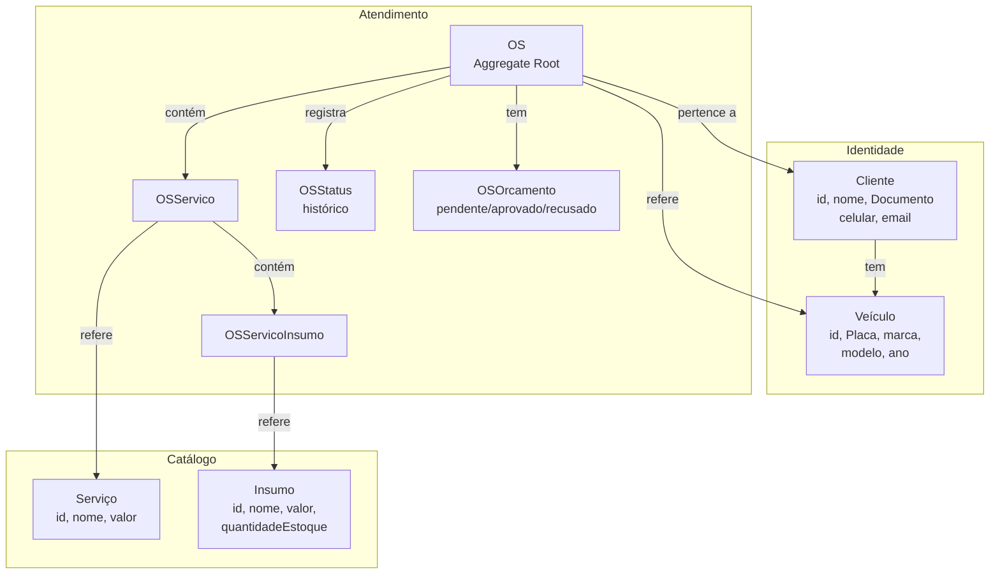

# Oficina Mecânica API

MVP do sistema integrado de atendimento e execução de serviços — back-end em Laravel 11.

## Stack e justificativas

- **PHP 8.2+** / **Laravel 11**
- **PostgreSQL 16** — escolhido pela integridade referencial robusta (chaves estrangeiras, constraints), suporte nativo a tipos avançados, performance superior em queries de agregação (cálculo de tempo médio de execução) e compatibilidade total com o ecossistema Laravel/Eloquent
- **Laravel Sanctum** — autenticação token-based simples e adequada para APIs SPA/mobile
- **L5-Swagger (OpenAPI 3.0)** — documentação das APIs gerada a partir de atributos PHP 8 em `/api/documentation`
- **PHPUnit** com SQLite em memória nos testes — isolamento total, sem dependência de banco externo

## Arquitetura

Monolito com DDD em camadas:

```
src/
├── Domain/
│   ├── Shared/ValueObjects/        # Documento (CPF/CNPJ), Placa
│   ├── Catalogo/                   # Servico, Insumo, repositórios
│   ├── Identidade/                 # Cliente, Veiculo, repositórios
│   └── Atendimento/                # OS (Aggregate Root), OSOrcamento, OSStatus
├── Application/
│   ├── Servico/UseCases/
│   ├── Insumo/UseCases/
│   ├── Cliente/UseCases/
│   ├── Veiculo/UseCases/
│   └── OS/UseCases/
└── Infrastructure/Persistence/Eloquent/
    ├── *Mapper.php                 # Model Eloquent ↔ Entidade de domínio
    └── Eloquent*Repository.php     # Implementações dos repositórios
```

## Como rodar com Docker

```bash
cp .env.example .env
# ajuste .env se necessário (DB_HOST=db já configurado)

docker compose up -d
docker compose exec app php artisan key:generate
docker compose exec app php artisan migrate --seed
```

A API ficará disponível em `http://localhost:8000`.
Documentação Swagger: `http://localhost:8000/api/documentation`

## Como rodar localmente (sem Docker)

```bash
cp .env.example .env
# configure DB_CONNECTION=pgsql, DB_HOST=127.0.0.1 e crie o banco manualmente

composer install
php artisan key:generate
php artisan migrate --seed
php artisan serve
```

## Como rodar os testes com cobertura

```bash
# Testes simples (SQLite em memória, sem configuração de banco)
php artisan test

# Com relatório de cobertura (requer Xdebug ou PCOV)
php artisan test --coverage --min=80
```

## Endpoints

| Método | Rota | Auth | Descrição |
|--------|------|------|-----------|
| POST | `/api/login` | Não | Autenticar e obter token |
| POST | `/api/logout` | Sim | Revogar token |
| GET | `/api/clientes` | Sim | Listar clientes |
| POST | `/api/clientes` | Sim | Criar cliente |
| GET | `/api/clientes/{id}` | Sim | Buscar cliente |
| PUT | `/api/clientes/{id}` | Sim | Atualizar cliente |
| DELETE | `/api/clientes/{id}` | Sim | Remover cliente |
| GET | `/api/veiculos` | Sim | Listar veículos |
| POST | `/api/veiculos` | Sim | Criar veículo |
| GET | `/api/veiculos/{id}` | Sim | Buscar veículo |
| PUT | `/api/veiculos/{id}` | Sim | Atualizar veículo |
| DELETE | `/api/veiculos/{id}` | Sim | Remover veículo |
| GET | `/api/servicos` | Sim | Listar serviços |
| POST | `/api/servicos` | Sim | Criar serviço |
| GET | `/api/servicos/{id}` | Sim | Buscar serviço |
| PUT | `/api/servicos/{id}` | Sim | Atualizar serviço |
| DELETE | `/api/servicos/{id}` | Sim | Remover serviço |
| GET | `/api/insumos` | Sim | Listar insumos |
| POST | `/api/insumos` | Sim | Criar insumo |
| GET | `/api/insumos/{id}` | Sim | Buscar insumo |
| PUT | `/api/insumos/{id}` | Sim | Atualizar insumo |
| DELETE | `/api/insumos/{id}` | Sim | Remover insumo |
| GET | `/api/os` | Sim | Listar ordens de serviço |
| POST | `/api/os` | Sim | Criar OS |
| GET | `/api/os/{id}` | Sim | Detalhar OS |
| PATCH | `/api/os/{id}/status` | Sim | Alterar status da OS |
| POST | `/api/os/{id}/servicos` | Sim | Adicionar serviço à OS |
| POST | `/api/os/{id}/servicos/{osServicoId}/insumos` | Sim | Adicionar insumo ao serviço |
| POST | `/api/os/{id}/orcamento` | Sim | Gerar orçamento |
| POST | `/api/os/{id}/orcamento/aprovar` | Sim | Aprovar orçamento (baixa estoque) |
| POST | `/api/os/{id}/orcamento/recusar` | Sim | Recusar orçamento |
| GET | `/api/os/tempo-medio` | Sim | Tempo médio de execução (minutos) |
| GET | `/api/consulta-publica` | Não | Status da OS por documento + placa |

Documentação completa: `GET /api/documentation`

## Bounded Contexts



> `User` existe apenas como infraestrutura de autenticação (Sanctum) — não pertence ao domínio da oficina.
