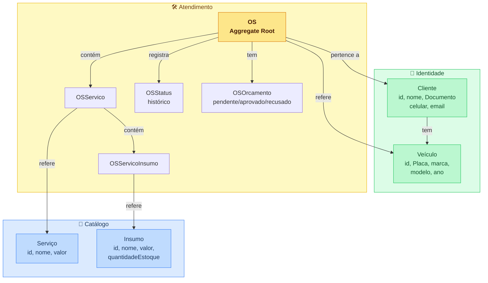

# Oficina Mecânica API

MVP do sistema integrado de atendimento e execução de serviços — back-end em Laravel 11.

## API em produção

Base URL: `https://oficinamecanica-production-46fd.up.railway.app`

Importe o `openapi.yaml` no Insomnia ou Postman e troque o servidor base pela URL acima para testar os endpoints sem precisar rodar nada localmente.

**Fluxo rápido para testar:**
1. `POST /api/login` com `{"email":"...", "password":"..."}` → obtém o token
2. Use o token no header `Authorization: Bearer {token}` nas demais rotas

## Stack e justificativas

- **PHP 8.4** / **Laravel 11**
- **PostgreSQL 16** — integridade referencial robusta (FKs, constraints), performance superior em queries de agregação (cálculo de tempo médio) e compatibilidade total com o ecossistema Laravel/Eloquent
- **Laravel Sanctum** — autenticação token-based simples e adequada para APIs SPA/mobile
- **OpenAPI 3.0** — especificação manual em `openapi.yaml`, importável diretamente no Insomnia/Postman, sem dependências de runtime
- **PHPUnit** com SQLite em memória nos testes — isolamento total, sem dependência de banco externo
- **PCOV** — driver de cobertura de código leve, instalado no container Docker via PECL

## Arquitetura

Monolito com DDD em camadas:

```
src/
├── Domain/
│   ├── Shared/ValueObjects/        # Documento (CPF/CNPJ), Placa
│   ├── Catalogo/                   # Servico, Insumo, repositórios
│   ├── Identidade/                 # Cliente, Veiculo, repositórios
│   └── Atendimento/                # OS (Aggregate Root), OSOrcamento, OSStatus
├── Application/
│   ├── Servico/UseCases/
│   ├── Insumo/UseCases/
│   ├── Cliente/UseCases/
│   ├── Veiculo/UseCases/
│   └── OS/UseCases/
└── Infrastructure/Persistence/Eloquent/
    ├── *Mapper.php                 # Model Eloquent ↔ Entidade de domínio
    └── Eloquent*Repository.php     # Implementações dos repositórios
```

## Como rodar com Docker

```bash
cp .env.example .env
# ajuste .env se necessário (DB_HOST=db já configurado)

docker compose up -d
docker compose exec app php artisan key:generate
docker compose exec app php artisan migrate --seed
```

A API ficará disponível em `http://localhost:8000`.
Importe `openapi.yaml` no Insomnia ou Postman para explorar os endpoints.

## Como rodar localmente (sem Docker)

```bash
cp .env.example .env
# configure DB_CONNECTION=pgsql, DB_HOST=127.0.0.1 e crie o banco manualmente

composer install
php artisan key:generate
php artisan migrate --seed
php artisan serve
```

## Notificações por e-mail (Resend)

A alteração de status de uma OS (manual ou via aprovação de orçamento) dispara um e-mail
ao cliente usando o pacote [`resend/resend-laravel`](https://github.com/resendlabs/resend-laravel),
integrado ao `Mail::` do Laravel. Se o cliente não tiver e-mail cadastrado, a alteração de
status conclui normalmente (apenas registra em log, sem falhar).

Configure no `.env` (a chave real **nunca** é commitada; mantenha-a em branco no `.env.example`):

```dotenv
MAIL_MAILER=resend
MAIL_FROM_ADDRESS="oficina@seudominio.com"
MAIL_FROM_NAME="Oficina Mecânica"
RESEND_API_KEY=            # sua chave da Resend (deixe em branco no .env.example)
```

Nos testes usa-se `Mail::fake()`, portanto nenhuma chave real é necessária para rodar a suíte.
Em produção o envio deveria rodar em uma **fila** dedicada (aqui usa o driver síncrono padrão).

## Como rodar os testes com cobertura

```bash
# Testes simples (SQLite em memória, sem configuração de banco)
php artisan test

# Com relatório de cobertura (requer Xdebug ou PCOV)
php artisan test --coverage --min=80
```

## Infraestrutura: Kubernetes, Terraform e CI/CD

Esta fase adiciona uma **camada de infraestrutura** que roda a mesma aplicação orquestrada em **Kubernetes**, provisionada por **Terraform (IaC)** e entregue por uma **pipeline CI/CD**, com **escalabilidade automática (HPA)**. É **independente e paralela** ao deploy no Railway — não usa nem referencia o `Dockerfile` da raiz, o `railway.json` ou o entrypoint do Railway.

**Objetivos:** empacotar a aplicação em imagem de produção (FrankenPHP), orquestrá-la em K8s (Deployment, Service, ConfigMap, Secret, HPA, Postgres StatefulSet, Job de migração), provisionar o cluster/banco/segredos via Terraform e demonstrar autoscaling sob carga.

### Componentes e infraestrutura provisionada

```
   TERRAFORM (/infra)  →  plataforma          KUBECTL (/k8s)  →  aplicação
   ├─ cluster kind (control-plane + worker)   ├─ ConfigMap (config não-sensível)
   ├─ metrics-server (habilita o HPA)         ├─ Job migrate (migrate + seed, 1x)
   ├─ namespace "oficina"                     ├─ Deployment app (FrankenPHP, N réplicas)
   ├─ Secret (APP_KEY, DB_PASSWORD, RESEND)   ├─ Service (ClusterIP) + Ingress opcional
   └─ Postgres (StatefulSet + Service + PVC)  └─ HPA (CPU ~50%, 2→10 réplicas)

                    ┌───────────────── cluster kind ─────────────────┐
   k6 (/load) ─────▶│ Service ▶ pods app ─CPU▶ metrics-server ▶ HPA │
                    │                              └─ escala pods ───┘│
                    │            Job migrate ▶ Postgres (PVC)         │
                    └────────────────────────────────────────────────┘
```

### Fluxo de deploy

```
  git push main
      │
      ▼  ci.yml  → testes + SonarCloud            (inalterado)
      ▼  cd.yml  → build → testes → imagem GHCR
                   → kind efêmero → kind load
                   → metrics-server + namespace + secret + Postgres
                   → kubectl apply -k k8s/ (app)
                   → smoke test (GET /up)
```

> **Estratégia de deploy no CI:** como o ambiente é local (sem cloud paga), o `cd.yml` faz o deploy num **cluster kind efêmero dentro do runner** — prova que os manifestos sobem ponta-a-ponta e roda um smoke test — e é destruído ao fim. O **ambiente persistente** para uso/demonstração é o kind local (abaixo). O Railway segue independente.

### Provisionamento com Terraform (`/infra`)

Provisiona cluster + metrics-server + namespace + Secret + Postgres. Detalhes e tabela de recursos em [`infra/README.md`](infra/README.md).

**Pré-requisitos:** Docker (rodando), `kind`, `kubectl`, `terraform`, `helm` e `k6`
(no macOS: `brew install kind kubectl terraform helm k6`).

### Passo a passo local (do zero)

```bash
# 0. APP_KEY e variáveis sensíveis (não versionadas)
cd infra
cp terraform.tfvars.example terraform.tfvars
php ../artisan key:generate --show   # copie o "base64:..." para app_key no terraform.tfvars
#   (sem PHP à mão? use: echo "base64:$(openssl rand -base64 32)")

# 1. Provisionar a plataforma (cluster kind + metrics-server + namespace + secret + Postgres)
terraform init
terraform apply        # confirme com "yes"

# 2. Apontar o kubectl para o cluster (o Terraform gera este kubeconfig)
export KUBECONFIG="$PWD/oficina-config"
kubectl get nodes

# 3. Construir a imagem de produção e carregá-la no kind
cd ..
docker build -f docker/app/Dockerfile -t ghcr.io/lorenalgm/oficina-api:latest .
kind load docker-image ghcr.io/lorenalgm/oficina-api:latest --name oficina

# 4. Implantar a aplicação (ConfigMap, Job de migração, Deployment, Service, HPA)
kubectl apply -k k8s/
kubectl -n oficina rollout status deployment/oficina-api

# 5. Acessar a API (mantenha este terminal aberto)
kubectl -n oficina port-forward svc/oficina-api 8080:80
# -> em outro terminal:  curl http://localhost:8080/up
```

> O `KUBECONFIG` precisa apontar para `infra/oficina-config` em todo terminal novo
> (`export KUBECONFIG=.../oficina-api/infra/oficina-config`).

### Demonstração de autoscaling (HPA + k6)

Com a aplicação no ar e o `port-forward` ativo (passo 5), em **três terminais**
(todos com o `KUBECONFIG` exportado):

```bash
# terminal A — expõe a API
kubectl -n oficina port-forward svc/oficina-api 8080:80

# terminal B — observa o HPA e os pods escalando ao vivo
kubectl -n oficina get hpa,pods -w

# terminal C — dispara a carga
BASE_URL=http://localhost:8080 k6 run load/load-test.js
```

Sob carga (login → cria cliente/veículo → múltiplas `POST /api/os` + listagens), a CPU
ultrapassa o alvo (50%) e o HPA **aumenta as réplicas de 2 até 10**; ao cessar a carga,
após a janela de estabilização, **reduz de volta a 2**. Verificado localmente:
`2 → 4 → 6 → 8 → 10` durante o ramp-up. Detalhes em [`load/README.md`](load/README.md).

### Limpeza

```bash
cd infra && terraform destroy   # remove o cluster kind inteiro (Railway não é afetado)
```

### Imagem de produção (FrankenPHP)

`docker/app/Dockerfile` gera a imagem de produção publicada no GHCR (`ghcr.io/lorenalgm/oficina-api`), servindo `public/index.php` via FrankenPHP em modo clássico, sem executar migrate/seed no start (isso é responsabilidade do Job).

## Collection de APIs

Especificação OpenAPI em [`openapi.yaml`](openapi.yaml) — importe no Insomnia/Postman/Swagger. Base local: `http://localhost:8080`; produção (Railway): ver topo do README.

## Endpoints

### Autenticação

| Método | Rota | Auth | Descrição |
|--------|------|:----:|-----------|
| POST | `/api/login` | — | Autenticar e obter token Sanctum |
| POST | `/api/logout` | ✓ | Revogar token |

### Catálogo

| Método | Rota | Auth | Descrição |
|--------|------|:----:|-----------|
| GET | `/api/servicos` | ✓ | Listar serviços |
| POST | `/api/servicos` | ✓ | Criar serviço |
| GET | `/api/servicos/{id}` | ✓ | Buscar serviço |
| PUT | `/api/servicos/{id}` | ✓ | Atualizar serviço |
| DELETE | `/api/servicos/{id}` | ✓ | Remover serviço |
| GET | `/api/insumos` | ✓ | Listar insumos |
| POST | `/api/insumos` | ✓ | Criar insumo |
| GET | `/api/insumos/{id}` | ✓ | Buscar insumo |
| PUT | `/api/insumos/{id}` | ✓ | Atualizar insumo |
| DELETE | `/api/insumos/{id}` | ✓ | Remover insumo |

### Identidade

| Método | Rota | Auth | Descrição |
|--------|------|:----:|-----------|
| GET | `/api/clientes` | ✓ | Listar clientes |
| POST | `/api/clientes` | ✓ | Criar cliente (CPF/CNPJ validado) |
| GET | `/api/clientes/{id}` | ✓ | Buscar cliente |
| PUT | `/api/clientes/{id}` | ✓ | Atualizar cliente |
| DELETE | `/api/clientes/{id}` | ✓ | Remover cliente |
| GET | `/api/veiculos` | ✓ | Listar veículos |
| POST | `/api/veiculos` | ✓ | Criar veículo (placa validada) |
| GET | `/api/veiculos/{id}` | ✓ | Buscar veículo |
| PUT | `/api/veiculos/{id}` | ✓ | Atualizar veículo |
| DELETE | `/api/veiculos/{id}` | ✓ | Remover veículo |

### Atendimento

| Método | Rota | Auth | Descrição |
|--------|------|:----:|-----------|
| GET | `/api/os` | ✓ | Listar OS — exclui *Finalizada*/*Entregue*, ordena por prioridade de status e, no mesmo status, mais antigas primeiro |
| POST | `/api/os` | ✓ | Criar OS |
| GET | `/api/os/{id}` | ✓ | Detalhar OS |
| PATCH | `/api/os/{id}/status` | ✓ | Alterar status manualmente (dispara e-mail ao cliente) |
| POST | `/api/os/{id}/servicos` | ✓ | Adicionar serviço à OS |
| POST | `/api/os/{id}/servicos/{osServicoId}/insumos` | ✓ | Adicionar insumo ao serviço |
| POST | `/api/os/{id}/orcamento` | ✓ | Gerar orçamento → status *Aguardando aprovação*; retorna o `approval_token` |
| GET | `/api/os/tempo-medio` | ✓ | Tempo médio de execução (minutos) |

**Ordenação da listagem (`GET /api/os`):** prioridade *Em execução* > *Aguardando aprovação* > *Em diagnóstico* > *Recebida*; as OS *Finalizada* e *Entregue* não aparecem (exclusão apenas da listagem). Dentro de um mesmo status, as mais antigas (`created_at` ascendente) vêm primeiro. Filtros `cliente_id`, `veiculo_id` e `status_id` continuam válidos.

### Aprovação/recusa de orçamento (notificação externa)

Simulam a decisão vinda do cliente/sistema externo, portanto são **rotas públicas** (fora do `auth:sanctum`), autenticadas pelo `approval_token` gerado na criação do orçamento.

| Método | Rota | Auth | Descrição |
|--------|------|:----:|-----------|
| POST | `/api/os/{id}/orcamento/aprovar` | token | Aprovar orçamento → baixa estoque + status *Em execução* |
| POST | `/api/os/{id}/orcamento/recusar` | token | Recusar orçamento |

- O `token` é enviado via query string (`?token=...`) ou no corpo da requisição.
- Sem token válido → **401**. O token é de **uso único**: após aprovar/recusar ele é invalidado (evita replay).
- **Nota de produção:** o token aqui é opaco e por-OS, suficiente para o escopo acadêmico. Em produção usaríamos assinatura (HMAC) e expiração, e o disparo de e-mail rodaria em uma **fila** real (aqui usa o driver síncrono do Laravel).

### Consulta pública

| Método | Rota | Auth | Descrição |
|--------|------|:----:|-----------|
| GET | `/api/consulta-publica` | — | Status da OS por documento + placa (sem autenticação) |

## Bounded Contexts



> `User` existe apenas como infraestrutura de autenticação (Sanctum) — não pertence ao domínio da oficina.
