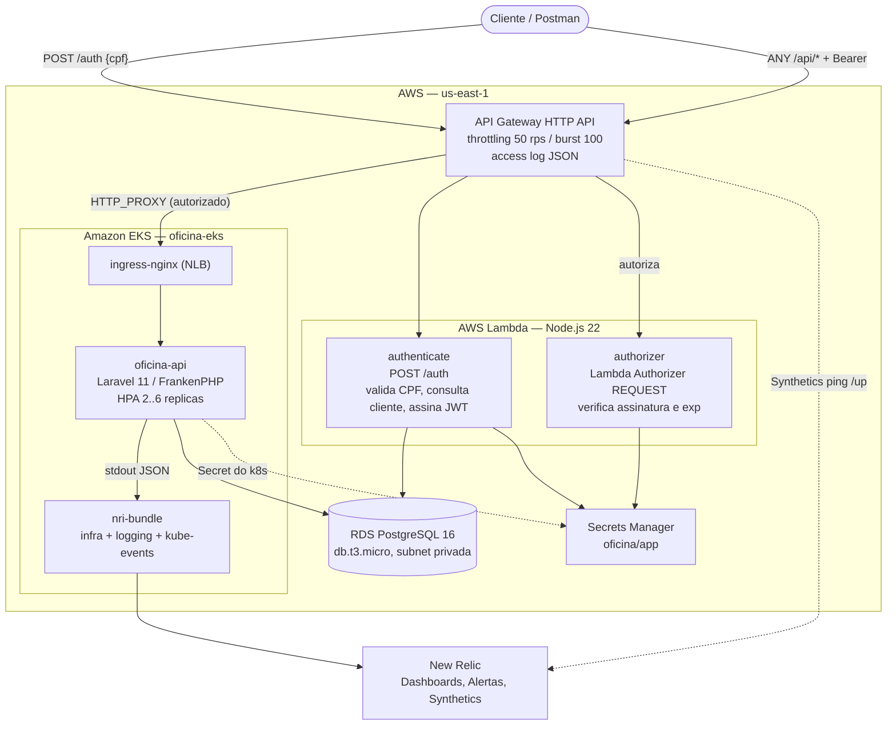

# Diagrama de componentes

## Responsabilidades

| Componente | Responsabilidade | Repositório |
|---|---|---|
| API Gateway | Porta única de entrada, throttling, log de acesso, delega autorização | `oficina-auth-lambda` |
| `authenticate` | Valida os dígitos do CPF, verifica se o cliente existe e emite o JWT HS256 | `oficina-auth-lambda` |
| `authorizer` | Valida o JWT em cada chamada a `/api/*` antes de o Gateway encaminhar | `oficina-auth-lambda` |
| `oficina-api` | Regras de negócio da oficina; revalida o JWT por conta própria | `oficina-api` |
| RDS PostgreSQL | Estado do domínio | `oficina-infra-db` |
| Secrets Manager | Credenciais do banco e segredo HS256 compartilhado | `oficina-infra-db` |
| EKS + ingress | Execução e escalabilidade da aplicação | `oficina-infra-k8s` |
| nri-bundle | Coleta logs, métricas de pod e eventos do cluster | `oficina-infra-k8s` |

## O JWT é validado duas vezes, de propósito

O Authorizer do Gateway rejeita o tráfego não autenticado na borda, antes de
consumir capacidade do cluster. O middleware `ValidarJwt` na aplicação repete a
verificação porque (a) o cluster é alcançável por dentro da VPC sem passar pelo
Gateway e (b) permite rodar a API inteira no kind, sem AWS, durante o
desenvolvimento. É defesa em profundidade, não redundância acidental —
detalhado no [ADR-001](../adrs/ADR-001-api-gateway-lambda-authorizer.md).
