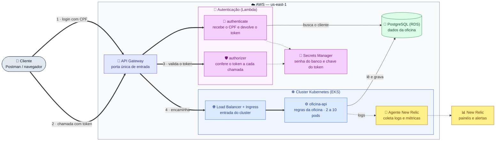

# Diagrama de componentes

Visão geral da Fase 3 na AWS. Leia o **caminho da requisição pelos números
(1 → 4)**. As setas pontilhadas são apoio: segredos e monitoramento.

**Legenda:** ⬜ cliente · 🟦 aplicação · 🟪 autenticação e segredos · 🟩 banco · 🟨 monitoramento

## Quem faz o quê

| Componente | Função | Repositório |
|---|---|---|
| API Gateway | Entrada única; limita a taxa de chamadas | `oficina-auth-lambda` |
| Lambda `authenticate` | Valida o CPF, busca o cliente e gera o token (JWT) | `oficina-auth-lambda` |
| Lambda `authorizer` | Bloqueia chamadas sem token válido antes de chegarem ao cluster | `oficina-auth-lambda` |
| `oficina-api` | Regras da oficina; confere o token de novo | `oficina-api` |
| EKS + Ingress | Roda a API e ajusta o número de pods | `oficina-infra-k8s` |
| Agente New Relic | Envia logs e métricas para os painéis | `oficina-infra-k8s` |
| RDS PostgreSQL | Guarda os dados | `oficina-infra-db` |
| Secrets Manager | Guarda a senha do banco e a chave do token | `oficina-infra-db` |

## Por que o token é conferido duas vezes

1. **No Gateway**, para barrar chamadas inválidas antes de gastar recursos do
   cluster.
2. **Na API**, porque o cluster também pode ser acessado sem passar pelo
   Gateway (por dentro da rede ou rodando local no kind).

Detalhes no [ADR-001](../adrs/ADR-001-api-gateway-lambda-authorizer.md).
