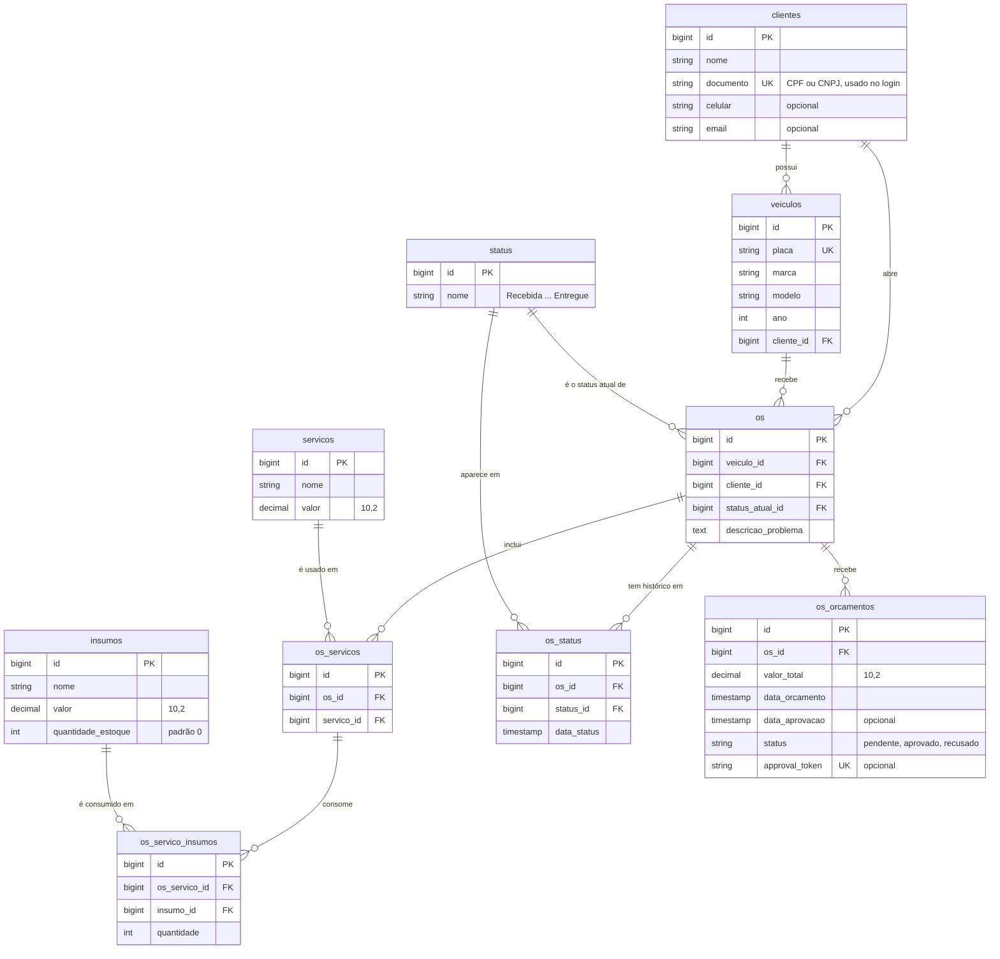

# Modelo de dados

Banco **PostgreSQL 16** (Amazon RDS). O diagrama foi montado a partir das
migrations em [`database/migrations`](../../database/migrations).

São **10 tabelas de negócio**, em três grupos:

| Grupo | Tabelas | O que guardam |
|---|---|---|
| 👤 Cadastro | `clientes`, `veiculos` | Quem é o cliente e quais carros ele tem |
| 🔧 Catálogo | `servicos`, `insumos`, `status` | O que a oficina oferece e os estados possíveis de uma OS |
| 🛠️ Atendimento | `os`, `os_servicos`, `os_servico_insumos`, `os_status`, `os_orcamentos` | A ordem de serviço e tudo o que acontece com ela |

> Colunas `created_at` / `updated_at` foram omitidas. Existem em `clientes`,
> `veiculos` e `os`.

## Relacionamentos

| Relação | Cardinalidade | Ao apagar o pai | Por quê |
|---|---|---|---|
| `clientes` → `veiculos` | 1 : N | apaga os veículos | Veículo não existe sem dono |
| `clientes` → `os` | 1 : N | **bloqueia** | Não se perde o histórico de atendimento |
| `veiculos` → `os` | 1 : N | **bloqueia** | Idem |
| `status` → `os` | 1 : N | **bloqueia** | Status é tabela de referência |
| `os` → `os_servicos` | 1 : N | apaga | Serviço da OS só faz sentido dentro dela |
| `servicos` → `os_servicos` | 1 : N | **bloqueia** | Não se apaga do catálogo um serviço em uso |
| `os_servicos` → `os_servico_insumos` | 1 : N | apaga | A peça pertence ao serviço daquela OS |
| `insumos` → `os_servico_insumos` | 1 : N | **bloqueia** | Não se apaga uma peça em uso |
| `os` → `os_status` | 1 : N | apaga | Histórico da própria OS |
| `status` → `os_status` | 1 : N | **bloqueia** | Tabela de referência |
| `os` → `os_orcamentos` | 1 : N | apaga | Orçamento é da OS |

## Pontos que merecem explicação

- **Status atual e histórico.** `os_status` guarda cada mudança de status com a
  data. É dela que sai o tempo médio por status. `os.status_atual_id` repete o
  último status só para a listagem de OS não precisar consultar o histórico
  linha a linha.
- **Peças ficam ligadas ao serviço, não à OS.** O caminho é
  `os → os_servicos → os_servico_insumos`. Assim se sabe qual peça foi usada em
  qual serviço, e remover um serviço remove as peças dele.
- **Orçamento.** O banco aceita mais de um orçamento por OS; a aplicação usa um
  (`hasOne` no model `OS`). O `approval_token` é único e permite ao cliente
  aprovar ou recusar por link, sem login. Ao aprovar, o estoque das peças é
  baixado.
- **`clientes.documento` é único** porque é a chave da autenticação: a Lambda
  busca o cliente pelo CPF, e ele precisa apontar para um cliente só.
- **Valores em `decimal(10,2)`**, nunca ponto flutuante, para não haver erro de
  arredondamento em dinheiro.

## Tabelas fora do domínio

Criadas pelo Laravel e não usadas pelas regras da oficina: `users`,
`password_reset_tokens`, `sessions`, `personal_access_tokens` (login antigo da
Fase 2, via Sanctum), `cache`, `cache_locks`, `jobs`, `job_batches` e `failed_jobs`.
