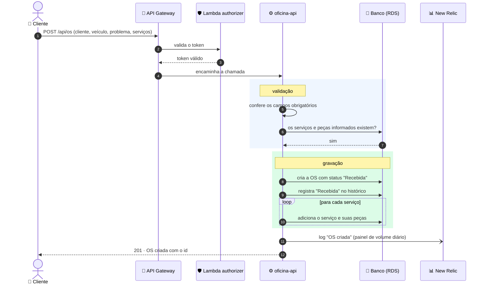

# Abertura de ordem de serviço

## Fluxo da requisição

Se algum serviço ou peça não existir, a API responde com erro **antes** de
gravar, para não sobrar OS pela metade.

## Ciclo de vida da OS

```mermaid
stateDiagram-v2
    direction LR
    [*] --> Recebida
    Recebida --> EmDiagnostico: técnico avalia
    EmDiagnostico --> AguardandoAprovacao: orçamento gerado
    AguardandoAprovacao --> EmExecucao: cliente aprova
    EmExecucao --> Finalizada: serviço concluído
    Finalizada --> Entregue: cliente retira o carro
    Entregue --> [*]

    EmDiagnostico: Em diagnóstico
    AguardandoAprovacao: Aguardando aprovação
    EmExecucao: Em execução

    classDef inicio fill:#e0e7ff,stroke:#4f46e5,color:#312e81
    classDef espera fill:#fef08a,stroke:#a16207,color:#713f12
    classDef trabalho fill:#dbeafe,stroke:#2563eb,color:#1e3a8a
    classDef fim fill:#dcfce7,stroke:#15803d,color:#14532d
    class Recebida inicio
    class AguardandoAprovacao espera
    class EmDiagnostico,EmExecucao trabalho
    class Finalizada,Entregue fim
```

- **Cada mudança de status** fica registrada na tabela `os_status` com a data.
  A diferença entre dois registros é o tempo gasto em cada etapa, usado no painel
  "tempo médio por status".
- **Aprovar o orçamento** baixa o estoque das peças e muda a OS para
  *Em execução*.
- **Recusar o orçamento** marca o orçamento como recusado; a OS continua em
  *Aguardando aprovação*.
- **Mudanças de status** disparam um e-mail ao cliente e uma métrica no New
  Relic, em partes separadas do código: se o e-mail falhar, a métrica continua
  sendo registrada.
