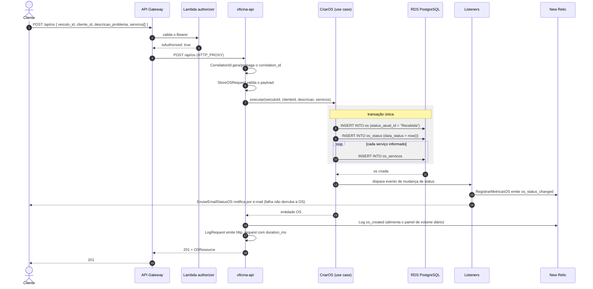
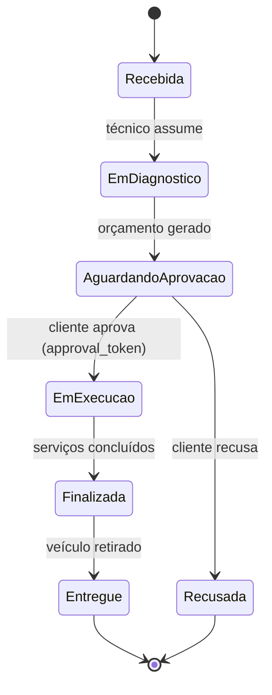

# Diagrama de sequência — abertura de ordem de serviço

## Por que a telemetria está em dois listeners separados

`RegistrarMetricasOS` e `EnviarEmailStatusOS` escutam o mesmo evento, mas em
classes distintas. Se a telemetria vivesse dentro do listener de e-mail, uma
falha do provedor de e-mail levaria junto a métrica `os_status_changed` — e o
painel de tempo médio por status ficaria com buracos justamente nos momentos de
incidente, que é quando ele importa.

## Estados da OS

Cada transição grava uma linha em `os_status` com `data_status`. A diferença
entre linhas consecutivas é o `duracao_status_min` que o painel "tempo médio de
execução por status" consome.
