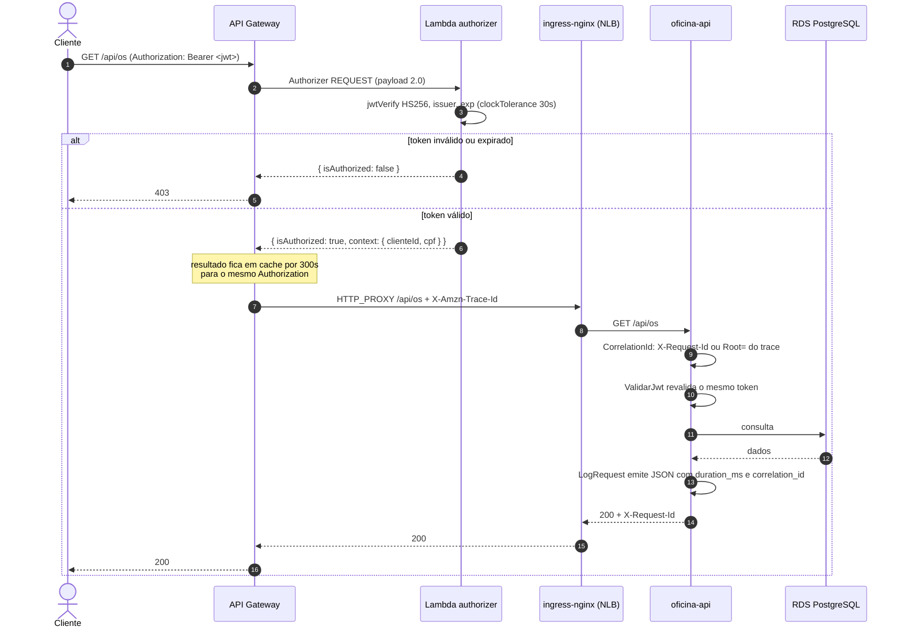

# Diagrama de sequência — autenticação por CPF

```mermaid
sequenceDiagram
    autonumber
    actor C as Cliente
    participant GW as API Gateway
    participant L as Lambda authenticate
    participant SM as Secrets Manager
    participant DB as RDS PostgreSQL

    C->>GW: POST /auth { "cpf": "529.982.247-25" }
    GW->>L: invoca (AWS_PROXY)

    alt primeira invocação do container
        L->>SM: GetSecretValue(oficina/app)
        SM-->>L: { DB_*, JWT_SECRET }
        Note over L: guarda em cache no módulo;<br/>invocações seguintes não repetem
    end

    L->>L: normaliza e valida os dígitos do CPF

    alt CPF inválido
        L-->>GW: 400 { "erro": "CPF inválido" }
        GW-->>C: 400
    else CPF válido
        L->>DB: SELECT id, nome FROM clientes WHERE documento = $1
        alt cliente não encontrado
            DB-->>L: 0 linhas
            L-->>GW: 404 { "erro": "Cliente não encontrado" }
            GW-->>C: 404
        else cliente encontrado
            DB-->>L: { id, nome }
            L->>L: assina JWT HS256 (iss, sub, cpf, nome, iat, exp=1h)
            L-->>GW: 200 { token, expires_in }
            GW-->>C: 200 + token
        end
    end
```

## Uso do token numa rota protegida


