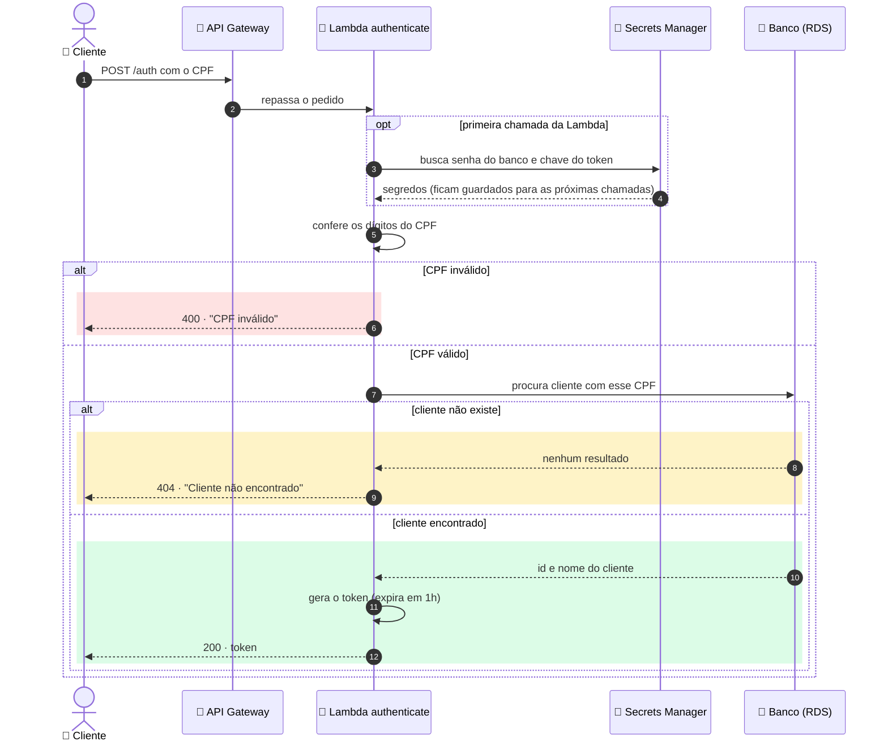
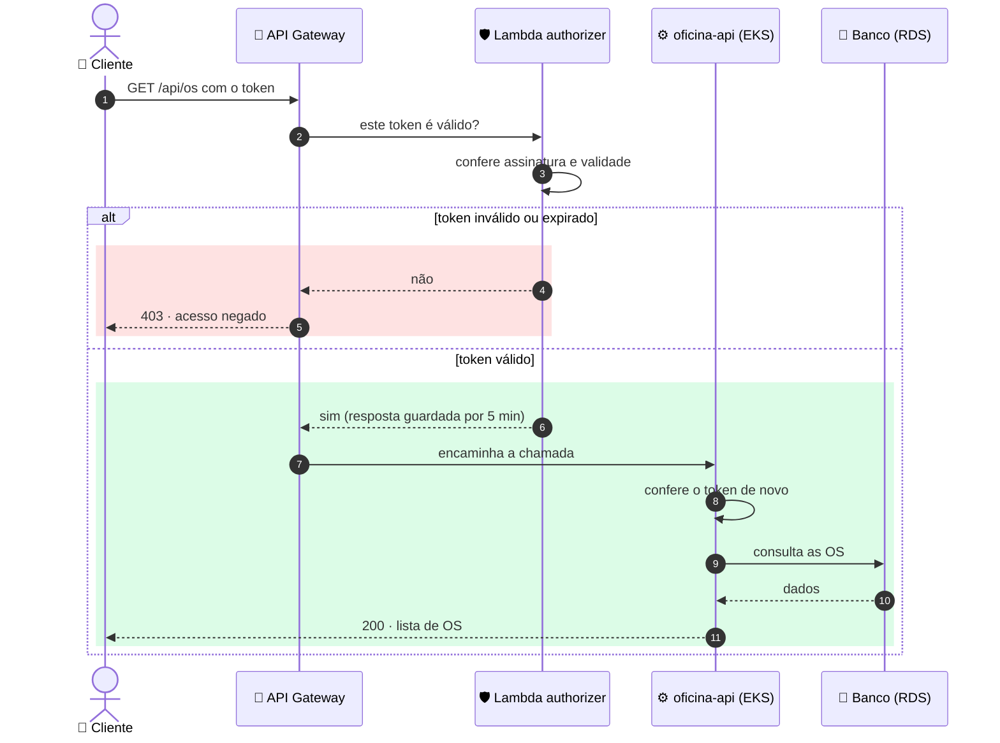

# Autenticação por CPF

O cliente troca o CPF por um **token (JWT)** válido por 1 hora e usa esse
token nas demais chamadas.

## 1. Login com CPF

## 2. Chamada protegida usando o token

**Cores:** 🟩 sucesso · 🟨 cliente não encontrado · 🟥 erro de acesso
