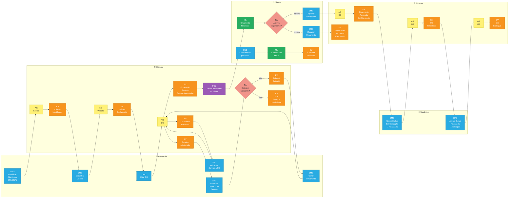
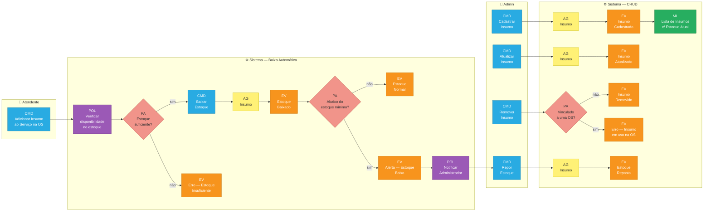

# Event Storming — Oficina Mecânica

> **Legenda:** 🟠 EV = Evento | 🔵 CMD = Comando | 🟡 AG = Agregado | 🟣 POL = Política | 🟢 ML = Modelo de Leitura | 🔷 PA = Ponto de Atenção

---

## Fluxo 1 — Criação e Acompanhamento da OS

---

## Fluxo 2 — Gestão de Peças e Insumos

